# Project 4 Part 4

### 1) Introduction and Goal
The goal of this project is to investigate how 3D Gaussian Splatting (3DGS) can be integrated into a modern game engine workflow — with Unreal Engine 5 (UE5) as the primary platform — in the context of AR rendering, and to evaluate whether such an integration is practically usable on Android, the most widely deployed mobile AR platform. Besides, the project re-implements **MobileGS** (ICLR 2026.3), a recently proposed 3DGS variant that redesigns the rendering (inferring) to target mobile GPUs, and ports its core pipeline into UE5 so that Gaussian-splat scenes can co-exist with traditional rendering pipeline (mesh and AR). In Mobile-GS paper, they claimed that their framework achieved 120 FPS in rendering 3DGS on mobile devices. Given the performance challenge on rendering 3DGS on mobile devices, it is nontrivial to integrate MobileGS
  
The central research question therefore is:
> *Under the real constraints of a UE5 Android AR build — how much of the photorealistic quality and performance of 3DGS can be preserved, and on what extent would MobileGS acceleration contribute to close the gap?*

The project delivers three coupled contributions:

1. **A UE5-native 3DGS renderer** that consumes standard `.ply` splat assets and composites them with UE5's mobile renderer and ARCore passthrough.
2. **A re-implementation of MobileGS's core acceleration ideas** adapted from the paper's reference CUDA code into UE5's RDG + mobile shader stack.

### 2) System Design and Implementation
#### Platform and stack
- Engine: Unreal Engine 5.7 + ARUtility plugin
- Target hardware: Windows PC for feasibility verification and Android phones for primary AR testing
- Hardware detail: PC (with RTX 3060 laptop), Android Phone (Samsung Galaxy S23+)
- Other SDKs involved: python 3.12 + pytorch + cuda 12.8
#### 3DGS 
Initially (in part 3), the project is built on top of the open-source **GaussianSplattingForUnrealEngine** plugin, extended (added SH evaluation support for better visual quality) to suit our AR / mobile evaluation goals. The core of the system is a Niagara-based 3DGS renderer that consumes `.ply` files produced by an upstream 3DGS training pipeline and draws them inside a standard UE5 scene, composited with conventional triangle-mesh content.
  
 When a `.ply` is loaded, the plugin parses it and pushes the per-Gaussian attributes (position, scale, rotation quaternion, opacity, SH color) into a Niagara emitter. The emitter allocate one Niagara particle per Gaussian and copy the raw attributes onto it. On every frame, an `UpdateSpriteSizeAndRotation` compute view data for current camera pose. Data were then passed to NiagaraSpriteRenderer (i) globally sorts the particles back-to-front , (ii) expands each particle into a camera-facing billboard quad, (iii) rasterizes the quads through the hardware rasterizer, and (iv) evaluates the 2D Gaussian footprint inside the pixel shader (custom material blueprint).
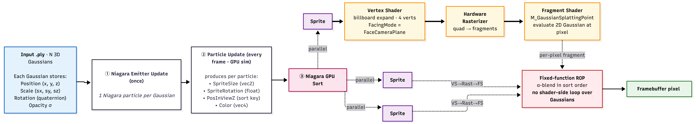
The Niagara-based pipeline is *not* a fully faithful implementation of the original 3DGS rasterizer. The reference CUDA implementation (Kerbl et al., SIGGRAPH 2023) performs **software rasterization**: every Gaussian is duplicated across the tiles it overlaps, the tile-splat pairs are radix-sorted by `(tileID, depth)`, and inside each pixel a hand-written serial loop iterates the tile's sorted Gaussian list and accumulates. In most of the UE5 build, each Gaussian becomes an independent **sprite proxy**, and the per-pixel serial α-blend loop disappears.

  
The original 3DGS rasterizer is written in software not because software rasterization is intrinsically better, but because the entire pipeline has to be *differentiable*. That is what forces the hand-written per-pixel loop — the translucent pipeline of pixel shader has no gradient. In the mobile-AR deployment target, however, swapping to hardware rasterization becomes the rational choice — it is simpler to integrate into an engine.
  
The rendering result is mathematically correct since they use same blending equation, while the occupation area of Gaussian may differ due to the gap between software and hardware resterization.

#### MobileGS Reproduce and Reimplementation
**Mobile-GS** (Du et al., ICLR 2026) is a latest improvement to 3DGS that reaches 116 FPS at 1600 × 1063 on a Snapdragon 8 Gen 3, on rendering 3DGS models. The paper identifies the **depth-sorting step of traditional alpha blending as the dominant bottleneck** (up to 50% of total frame time on the 3DGS CUDA rasterizer) and contributes four jointly-designed components to remove it. It proposed **Depth-aware order-independent rendering.** Replaces sort + sequential α-blending with an order-free weighted accumulation `C = (1−T) · Σ cᵢαᵢwᵢ / Σ αᵢwᵢ + T·c_bg`, where `wᵢ = φᵢ² + φᵢ/dᵢ² · exp(s_max/dᵢ²)` down-weights far Gaussians and up-weights near ones. In their implementation, αᵢ and φᵢ both come from a per-gaussian MLP output. For this project, Mobile-GS is particularly attractive as the re-implementation target because the claimed improved rendering performancing with no decrease in quality. 
  
Niagara itself was designed as a *general-purpose VFX system* — per-emitter scripting, interpreter overhead, spawn/kill bookkeeping, lifetime tracking, and the full attribute binding graph all run on every particle every frame, even though a static 3DGS scene needs none of them. On top of that, the `NiagaraSpriteRendererProperties` path is difficult to extend.
  
For the actual Mobile-GS implement we therefore switch the base from the Niagara plugin to the **NanoGaussianSplatting (NanoGS)**. NanoGS follows the same quad-proxy idea (one camera-facing quad per Gaussian, hardware rasterization, fragment-shader 2D Gaussian evaluation), but does the work inside a **custom post-processing render pass** rather than inside Niagara.

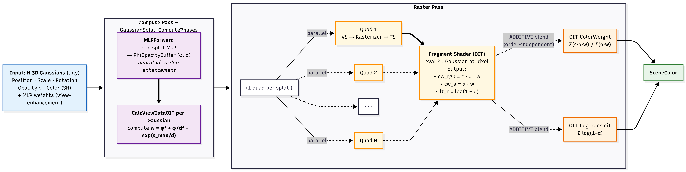

We first reproduce Mobile-GS's training pipeline to obtain the distilled assets — the compressed `.ply` (1st-order SH, VQ-quantized, contribution-pruned) paired with the trained view-enhancement MLP weights. We then extend NanoGS in UE5 so its render pipeline consumes these assets directly: a new `FGaussianMLPWeightsAsset` is loaded at asset-import time, and on every frame an MLP forward pass (`DispatchMLPForward`) runs per visible Gaussian to produce the per-splat `(φ, o)` pair that feeds the depth-aware weight and alphas consumed by the OIT raster stage described below. The rest of the NanoGS pipeline — cluster culling, compaction, hardware rasterization — is reused unchanged.
  
To verify the correctness of our UE5 RDG implementation of Mobile-GS components, we implemented a "unit test" module to ensure the compute shader MLP generate identical output with the official implementation under given camera pose. For verifying the OIT rendering, we extended graphdeco-inria/gaussian-splatting/SIBR_viewers for a Mobile-GS interactive viewer and manually check the visual similarity with similar camera poses between UE and SIBR_viewers. Pixel-wise image compare or image reconstruction metrics are not suitable for it since it is defficult to share the same background color in both scenario.

### 3) Build Instructions

**For APK Archive at [Github Release Page](https://github.com/Apeiria01/P4/releases/tag/1.0.0)**: Unzip and run `Install_GSPrac2-arm64.bat` with AndroidSDK Platform-tools in env to install the APK for a simple 3DGS or Mobile-GS in AR context demo. For Mobile-GS app, tap the screen with 4 fingers and run `r.GaussianSplat.UseOIT 1` to switch to Mobile-GS rendering

#### To import 3DGS and Mobile-GS model to UE and then deploy to Android AR, build NanoGaussianSplatting/Plugins/NanoGS (my final implementation), or GaussianSplattingForUnrealEngine(my implementation at p4-stage3, 3DGS only).

**For NanoGaussianSplatting**: Install UE 5.7.4, create an empty UE c++ project (or any template project, or just use your existing UE project)
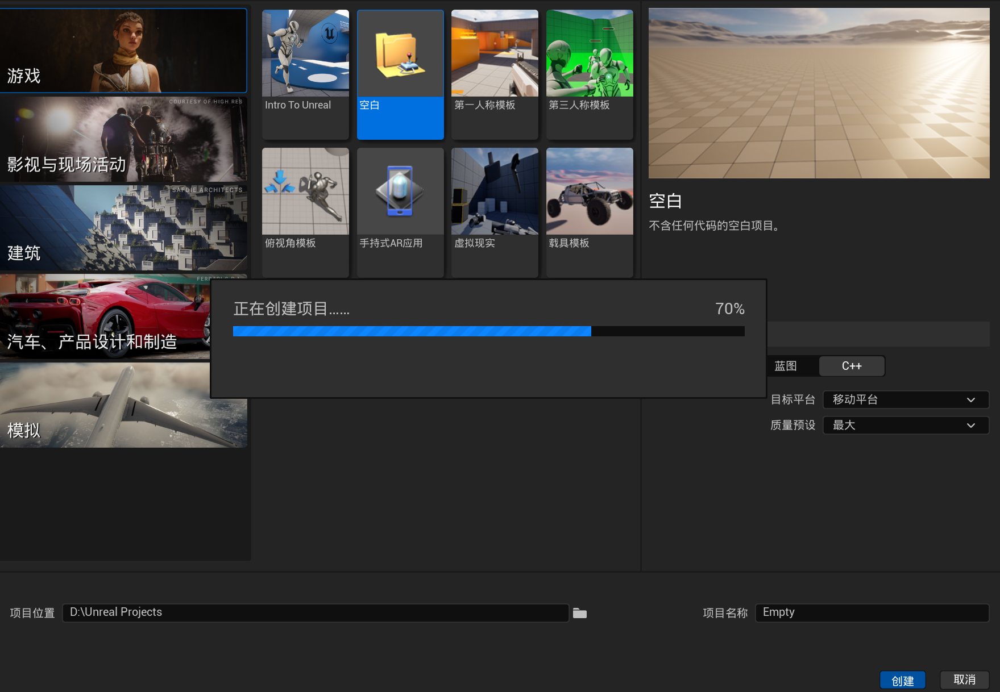
Place `NanoGaussianSplatting/Plugins/NanoGS` in the previously created UE projects' (or your existing UE projects') **Plugins** directory. 
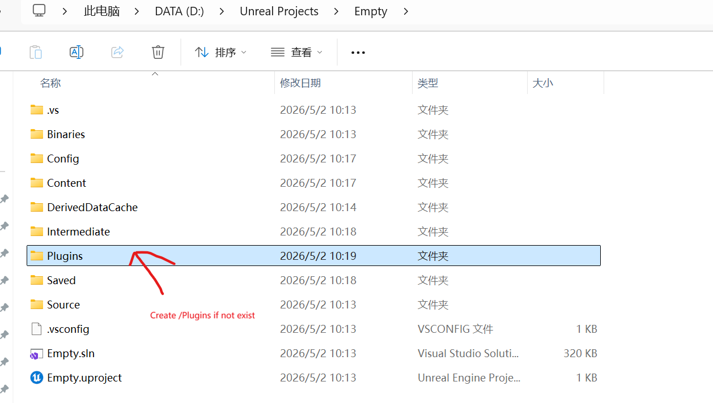
Right click the `Generate Visual Studio project files` to let the sln include the plugin into the build targets.
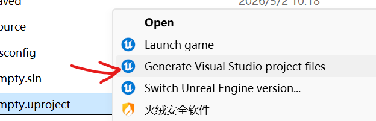
Now you should see the plugin in the .sln solution explorer. Compile the project with Visual Studio 2026 (configuration: Development Editor Win64, Right click on `Empty` (or your projects' name) and build). 
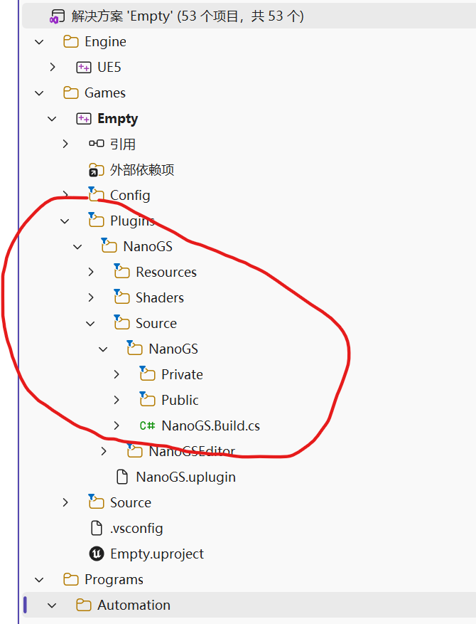
Run the project. In Unreal editor, click "Import" to import 3DGS ply files (sample available at [baked.ply](https://github.com/Apeiria01/P4/releases/download/1.0.0/baked.ply)) or mlp_weights.mgsbin generated by Mobile-GS/export_mlp_weights.py (sample available at [mlp_weights.mgsbin](https://github.com/Apeiria01/P4/releases/download/1.0.0/mlp_weights.mgsbin)).
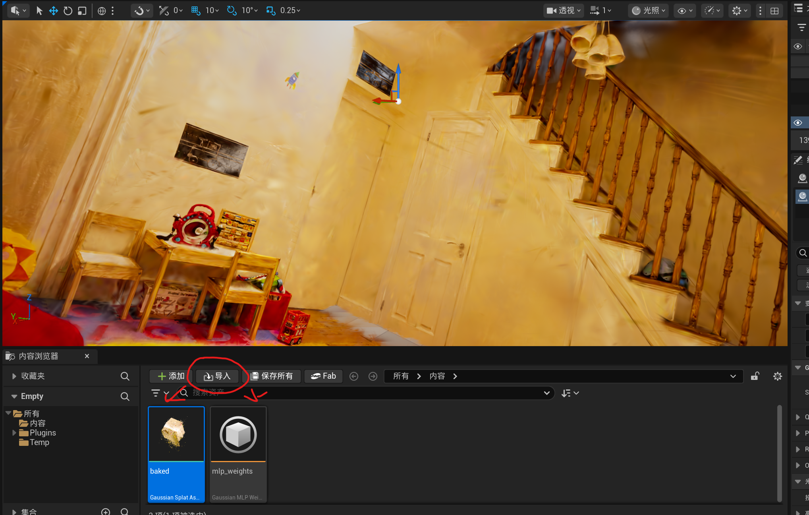
For an imported asset, if it is MobileGS data, double click to open detail panel and associate it with the mlp binary asset like the following image:
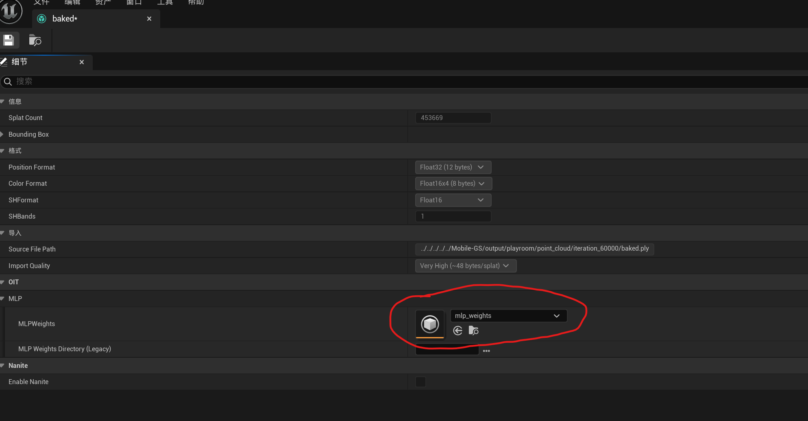
If it is 3DGS data (sample data available at [point_cloud.ply](https://github.com/Apeiria01/P4/releases/download/1.0.0/point_cloud.ply)), leave `MLPWeights` empty.
Drag Gaussian Splat assets into the scene to see the rendering. Run `r.GaussianSplat.UseOIT 0` or `r.GaussianSplat.UseOIT 1` in Unreal Editor command line to alter between 3DGS and Mobile-GS rendering. If looks visual incorrect, toggle the `Enable MLPWeights` in detail panel:
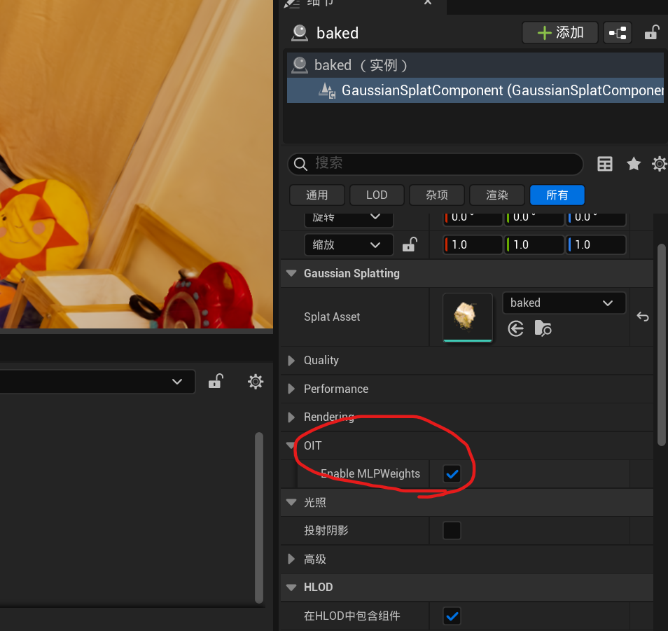

**For GaussianSplattingForUnrealEngine**: Install UE 5.7.4, place Plugins/NanoGS in UE projects' **Plugins** directory, and compile the project with Visual Studio. like the previous plugin. 
  
**For Mobile-GS**: Run `pretrain.py` / `train.py` with same argument from readme of its original repos to get 3DGS/Mobile-GS data (C++ compiler + NVCC required to install the dependency).
  
**For MobileGS data**, run `python export_mlp_weights.py [opacity_phi_nn.pt path]` to consume the "opacity_phi_nn.pt" to generate .mgsbin file required by NanoGS. Run `python bake_for_ue5.py --source [MobileGS ply dir]` to fetch the base color of Mobile-GS data and generate a new ply file to be imported by NanoGS. (color was not stored in raw output .ply files since they are also encoded with MLP in Mobile-GS's official implementation)

**For SIBR_viewers**: Clone [3DGS](https://github.com/graphdeco-inria/gaussian-splatting) recursively. Configure Cmake for gaussian-splatting/SIBR_viewers, replace SIBR_viewers/extlibs/CudaRasterizer with [CudaRasterizer](https://github.com/Apeiria01/CudaRasterize)

### 4) Metrics and Results

**On-device performance** — measured on both PC and Android target introduced above. We report end-to-end **FPS** plus a per-stage **render-time breakdown** so that the contribution of each Mobile-GS component can be isolated.
**AR compositing realism** — a subjective read on how well the rendered 3DGS content "fits" in the live camera feed.

We **do not** report PSNR, SSIM, or LPIPS. Those metrics assume a held-out test view from a *training* pipeline.

**Test scenes.** `.ply` assets gathered from training on **Playroom** scene (Tanks & Temples + Deep Blending benchmark suite). There are 4 variants of it: 1 of them generated with 30000 iteration of 3DGS training (also Mobile-GS pretrain) with 510201 Gaussians, 1 of them from Mobile-GS training with 453669 Gaussians, and clipped version (remove some GS point from indoor scene to better fit AR) of the previous. Additionally a `.ply` asset of fly downloaded from internet.

The following 2 images showing 3DGS and Mobile-GS running for **Playroom** scene in UE editor with correctly handling occlusions with mesh 3D scene:
3DGS:
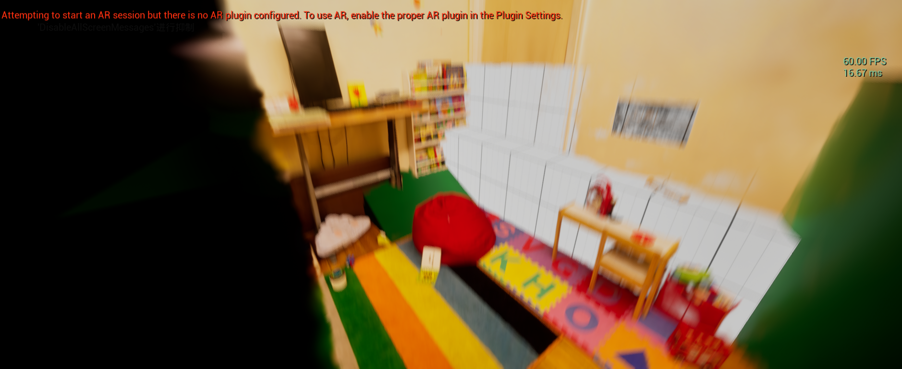
Mobile-GS:
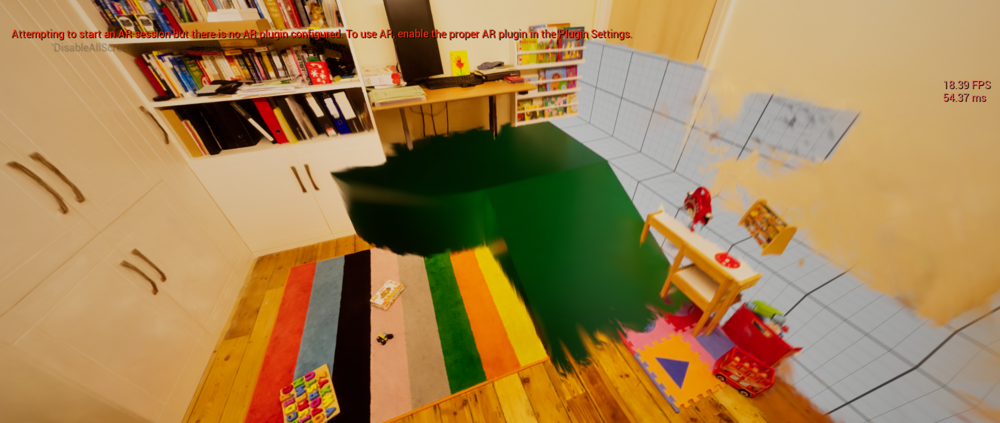
  
  
**Result**

Measured FPS:
On Android:
| Method | FPS | Gaussian Count |
|---|---|---|
| Mobile-GS | 1 | 453669 | 
| 3DGS | 27 | 510201 |

On PC:
| Method | FPS | Gaussian Count |
|---|---|---|
| Mobile-GS | 13 | 453669 | 
| 3DGS | 70 | 510201 |

  
  

Per Render Stage (Stat only available on PC):
3DGS:
| Stage | Time | Percentage in Total Frame Time |
|---|---|---|
| Total | 16.57ms | 100% |
| Radix Sort | 0.619ms | 3.7% |
| Calc View Data | 0.299ms | 1.8% |
| Draw Quad | 8.665ms | 52.3% |

MobileGS:
| Stage | Time | Percentage in Total Frame Time |
|---|---|---|
| Total | 84.01ms | 100% |
| MLP infer | 58.22ms | 69.3% | 
| Draw Quad (OIT)| 17.43ms | 20.7% |

In our profiling the dominant per-frame cost of Mobile-GS is the MLP forward pass. The rasterization stage itself is also roughly 2× the cost of the original 3DGS path, which might be due the OIT accumulation render targets: the weight formula `w = φ² + φ/d² + exp(s_max/d)` can drive `α·w` well past the fp16 range (65504), so the two accumulation buffers (`OIT_ColorWeight` as RGBA32F, `OIT_LogTransmit` as R32F) must be 32-bit per channel to stay numerically correct. That increase the per-pixel bandwidth compared with the fp16 target the non-OIT path can get away with. 

  

As the indoor scene differs little from a sky box texture, we used both the clipped indoor scene and "fly" ply to test on Android AR context. Although we implemented correct interop with scene depth (it can correctly handle occlusion with mesh objects), the depth based occlusion mechanism of AR plugin is incompatible with current UE build.

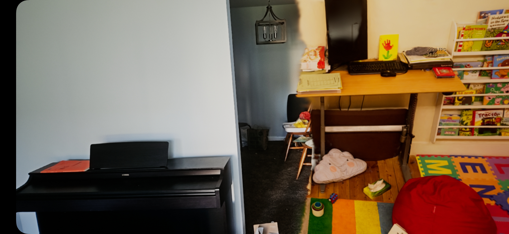
**Rendering indoor 3DGS scene in Mobile AR context**

[Video](https://youtu.be/yn2G21qlHos)
**Demo video with "fly" 3DGS scene**

### 5 ) Conclusion

Even though 3DGS reproduces the source scene with photorealistic rendering, whether the result *looks real inside an AR feed* is determined by a separate set of cues: correct occlusion against the physical environment and stable anchoring on real surfaces. In our current build the AR plugin's depth-based occlusion and depth-aware tracking are both incompatible with UE5.7 (it cause crashes when starting AR session), so splats always render on top of every real object regardless of true depth and drift slightly against the ground plane during locomotion. 

We were unable to reproduce Mobile-GS's finding that the radix sort is the dominant cost of 3DGS rendering. A plausible explanation is the duplication step that precedes sorting in the software rasterizer: every Gaussian is emitted once per tile its 3σ footprint overlaps, so the sort key buffer typically inflates to roughly 10× the scene's Gaussian count before being radix-sorted. NanoGS's hardware-rasterization path in UE5 has no tile-duplication stage — each Gaussian contributes one quad, one draw, one sort key — so the sort operates on a list of the original length. In our profiling under this regime, the sort never emerges as the critical stage; the MLP forward pass discussed above remains the dominant cost, and Mobile-GS's sort-centric motivation appears to be an artifact of the software rasterizer's data expansion rather than a property of 3DGS rendering in general. While in our baseline "SIBR_Viewer" of 3DGS (used software rasterization), the sorting stage consists 25% of total rendering time, which match the findings in Mobile-GS paper.

  
In reproducing Mobile-GS we noticed that its headline FPS numbers appear to exclude a substantial portion of the per-frame work. Although the method relies on several MLPs — and crucially on a view-dependent enhancement MLP that must run **every frame** — the benchmarking code in the official repository times only the CUDA rasterization kernel that consumes the already-computed `(φ, α)`, not the MLP forward pass that produces them. In our local reproduction this matches: measuring only the rasterizing kernel on PC GPU gives ~600 FPS, matching the paper's 1098 FPS claim, whereas an end-to-end timing that includes the per-frame MLP forward is dominated by the MLP itself. The project's Github issue page indicates that the authors hold an internal Vulkan build with unannounced MLP inference optimizations withheld for company-policy reasons; without access to or an implementation of that optimization, our UE5 implementation cannot further improve the rendering performance.

**Future work.** Three directions naturally extend this project. *(1) A software-rasterization 3DGS path inside UE5.* Implementing the 3DGS software rasterizer as a compute-shader RDG pass would give Mobile-GS a like-for-like baseline inside the same engine, isolating what the OIT reformulation actually contributes from what is simply an artifact of switching rasterization strategy. *(2) Depth-capable AR integration.* Swapping the current AR backend (or Engine version) for one that works on per-frame depth would let us route the environment depth into the OIT composite pass to cull splats occluded by real geometry, and alsostabilize anchoring — the single largest win available for realism. *(3) Mobile-friendly MLP and rasterization acceleration.* Reproducing Mobile-GS's undisclosed Vulkan-level MLP optimizations (or finding a cheaper equivalent) is the only path that could plausibly close the end-to-end gap with original 3DGS on mobile, and would turn Mobile-GS from "novel but slower in our build" into a genuinely preferable mobile-AR primitive.

### 6 ) References 
- 3DGS (SIGGRAPH 2023)
  - Paper: [https://repo-sam.inria.fr/fungraph/3d-gaussian-splatting/3d_gaussian_splatting_high.pdf](https://repo-sam.inria.fr/fungraph/3d-gaussian-splatting/3d_gaussian_splatting_high.pdf)
  - Repository: [https://github.com/graphdeco-inria/gaussian-splatting](https://github.com/graphdeco-inria/gaussian-splatting)
- Mobile-GS (ICLR 2026)
  - Paper: [https://arxiv.org/abs/2603.11531](https://arxiv.org/abs/2603.11531)
  - Repository: [https://github.com/xiaobiaodu/Mobile-GS](https://github.com/xiaobiaodu/Mobile-GS)

- UE 3DGS repositories as engineering references:
  - [GaussianSplattingForUnrealEngine](https://github.com/Italink/GaussianSplattingForUnrealEngine)
  - [NanoGaussianSplatting](https://github.com/TimChen1383/NanoGaussianSplatting)

- Other tools:
- [SuperSplat](https://superspl.at/)
- [Unreal Engine](https://www.unrealengine.com/)

